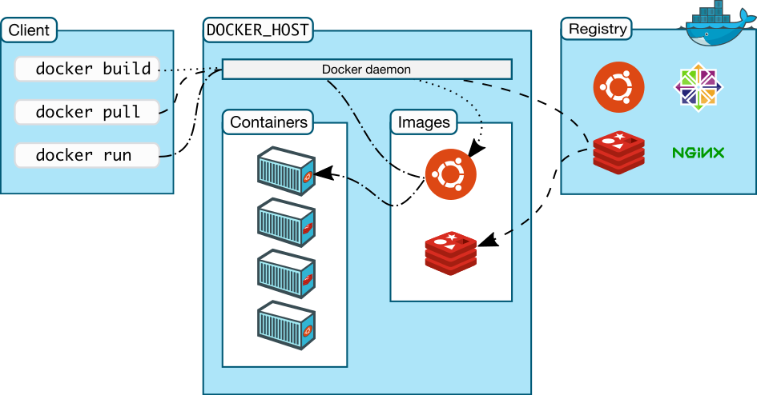

# Docker <!--fit--> :whale:


---

# O que é Docker?

---

> [...] Docker é uma plataforma aberta, criada com o objetivo de facilitar o desenvolvimento, a implantação e a execução de aplicações em ambientes isolados.

(Gomes, 2019, p. 16)

---

# Arquitetura Docker



###### Imagem retirada de [https://docs.docker.com/engine/docker-overview/#docker-architecture](https://docs.docker.com/engine/docker-overview/#docker-architecture)

---

<!-- backgroundColor: #f84040 -->

# Demo <!--fit--> :smiling_imp:

---

<!-- backgroundColor: #fff -->

# Abra o terminal

`ctrl + alt + t`

---

# Instale o Docker

`curl -flSL https://get.docker.com | bash`

---

# Adicione seu usuário ao grupo Docker

`sudo usermod -aG docker $USER`

---

# Visualize o status do Docker

`sudo systemctl status docker`

---

# Olá mundo em Docker

`docker run hello-world`

---

<!-- Scoped style -->
<style scoped>
pre > code {
  font-size: 20px;
}
</style>
```
Hello from Docker!
This message shows that your installation appears to be working correctly.

To generate this message, Docker took the following steps:
 1. The Docker client contacted the Docker daemon.
 2. The Docker daemon pulled the "hello-world" image from the Docker Hub.
    (amd64)
 3. The Docker daemon created a new container from that image which runs the
    executable that produces the output you are currently reading.
 4. The Docker daemon streamed that output to the Docker client, which sent it
    to your terminal.

To try something more ambitious, you can run an Ubuntu container with:
 $ docker run -it ubuntu bash

Share images, automate workflows, and more with a free Docker ID:
 https://hub.docker.com/

For more examples and ideas, visit:
 https://docs.docker.com/get-started/
```

---

<!-- backgroundColor: beige -->

#  <!--fit--> :+1:

---

<!-- backgroundColor: white -->

# Referências

<!-- Scoped style -->
<style scoped>
p {
  text-align: left;
}
</style>

GOMES, Rafael. **Docker para desenvolvedores**. [S. l.]: 9bravos, 2019. 180 p. Disponível em: [https://leanpub.com/dockerparadesenvolvedores](https://leanpub.com/dockerparadesenvolvedores). Acesso em: 15 out. 2019.

Install using the convenience script. *In*: Get Docker Engine - Community for Ubuntu. **DOCKER**. Disponível em: [https://docs.docker.com/install/linux/docker-ce/ubuntu/#install-using-the-convenience-script](https://docs.docker.com/install/linux/docker-ce/ubuntu/#install-using-the-convenience-script). Acesso em: 15 out. 2019.